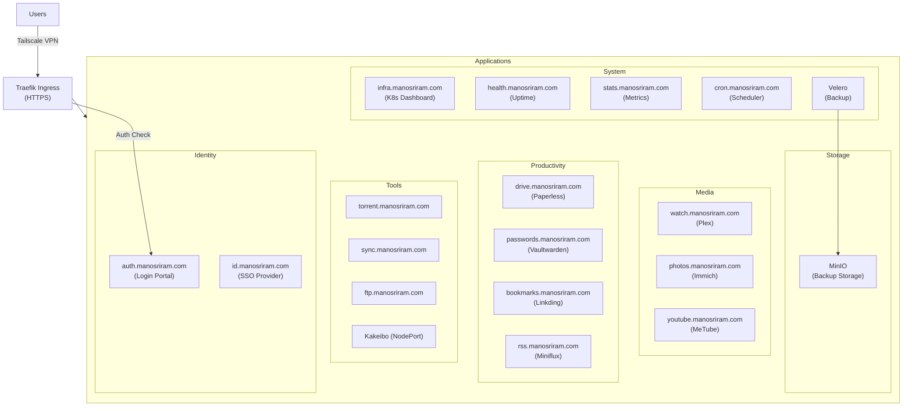

# K3s Homelab

Self-hosted services running on a single-node k3s cluster with Traefik ingress and Tailscale access.

## Architecture



## Access

All services are accessible via **Tailscale VPN** at `100.69.69.69`. Services with Tinyauth protection require login through `auth.manosriram.com` first.

## Deployment

```bash
# Deploy everything
kubectl apply -f k3s/manifests/ --recursive

# Deploy specific app
kubectl apply -f k3s/manifests/immich/

# Check status
kubectl get pods -A


# Or simply use scripts/k3s-deploy.sh
cp k3s-deploy /usr/local/bin;
k3s-deploy -d <dir> -n <namespace> deploy|delete
```

## Backups

- **Velero** for cluster backups (including MinIO) stored in MinIO
- **Daily** at 8:00 AM → Backblaze B2 (30 day retention)
- **Monthly** at 9:00 AM → Backblaze B2 (12 month retention)
- Health checks via healthchecks.io every 10 minutes
